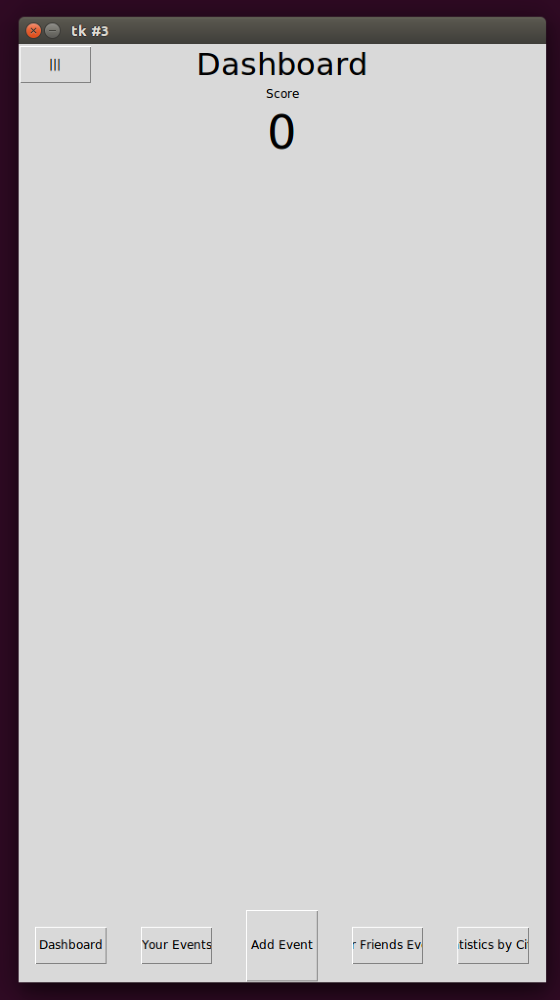

Table of Contents
=================
   * [Fase Elements](#fase-elements)
      * [Comparing Fase Elements to similar Elements in iOS/Android/Tkinter](#comparing-fase-elements-to-similar-elements-in-iosandroidtkinter)
      * [Data Classes](#data-classes)
      * [Elements Classes](#elements-classes)
   * [Fase Application Examples](#fase-application-examples)
      * [Hello World Application](#hello-world-application)
         * [Initial Screen](#initial-screen)
         * [Hello Screen](#hello-screen)
      * [Notes Application](#notes-application)
         * [Initial Screen](#initial-screen-1)
         * [Adding New Note](#adding-new-note)
         * [Home Screen with Notes](#home-screen-with-notes)
      * [KarmaCounter Application](#karmacounter-application)
         * [Sign In/Sign Up](#sign-insign-up)
         * [Sign Up](#sign-up)
         * [Dashboard](#dashboard)
         * [Your Events](#your-events)
         * [Adding Event to Yourself](#adding-event-to-yourself)
         * [Statistics by Cities](#statistics-by-cities)

# Fase Elements
## Comparing Fase Elements to similar Elements in iOS/Android/Tkinter
|Fase|iOS|Android|Tkinter|
|----|---|-------|-------|
|Frame|UIView|FrameLayout|Frame|
|Label|UILabel|TextView|Label|
|Text|UITextField|EditText|Entry|
|Switch|UISwitch|Switch|CheckButton|
|Selector|UIPickerView|Spinners|ComboBox|
|Image|UIImage|ImageView|Label|
|MenuItem|||Menu.add_command|
|Menu|||Menu|
|Button|UIButton|Button|Button|
|ButtonBar|||-|
|ContactPicker|||-|
|DateTimePicker|UIDatePicker|DatePicker|-|
|PlacePicker|Implemented using Google Place Picker|Implemented using Google Place Picker|-|

## Data Classes
* **Locale**
  * *country_code*: string

* **Contact**
  * *display_name*: string
  * *phone_number*: string

* **Place**
  * *google_place_id*: string
  * *country*: string
  * *state*: string
  * *city*: string

* **User**
  * *date_of_birth*: date
  * *last_name*: string
  * *home_city*: *Place*
  * *phone_number*: string
  * *first_name*: string
  * *datetime_added*: date
  * *user_id*: string

## Elements Classes
* **Element**. Basic Interface.

* **ElementContainer** extends *Element*. Basic Interface which contains list if id and Element pairs.
  * *id_element_list*: list(tuple(string, *Element* or subclass))

* **VisualElement** extends *ElementContainer*. Basic Interface for Visual Elements.
  * *id_element_list*: list(tuple(string, *Element* or subclass))
  * *displayed*: bool. If the Element should be displayed on the Screen.
  * *locale*: *Locale*. Ignore.
  * *request_locale*: bool. If the Element requests current Local during a Callback. 

* **Label** extends *VisualElement*
  * *on_click*: function
  * *alight*: int
    * LEFT = 1
    * RIGHT = 2
    * CENTER = 3
  * *font*: float
  * *locale*: *Locale*
  * *id_element_list*: list(tuple(string, *Element* or subclass))
  * *size*: int
    * MIN = 1
    * MAX = 2
  * *text*: string
  * *displayed*: bool
  * *request_locale*: bool

* **Text** extends *VisualElement*
  * *locale*: *Locale*
  * *id_element_list*: list(tuple(string, *Element* or subclass))
  * *size*: int
    * MIN = 1
    * MAX = 2
  * *text*: string
  * *displayed*: bool
  * *request_locale*: bool
  * *hint*: string

* **Switch** extends *VisualElement*
  * *displayed*: bool
  * *alight*: int
    * LEFT = 1
    * RIGHT = 2
    * CENTER = 3
  * *request_locale*: bool
  * *text*: string
  * *id_element_list*: list(tuple(string, *Element* or subclass))
  * *value*: bool
  * *locale*: *Locale*

* **Select** extends *VisualElement*
  * *items*: list(string)
  * *alight*: int
    * LEFT = 1
    * RIGHT = 2
    * CENTER = 3
  * *value*: string
  * *locale*: *Locale*
  * *id_element_list*: list(tuple(string, *Element* or subclass))
  * *displayed*: bool
  * *request_locale*: bool
  * *hint*: string

* **Image** extends *VisualElement*
  * *locale*: *Locale*
  * *id_element_list*: list(tuple(string, *Element* or subclass))
  * *image*: string
  * *displayed*: bool
  * *request_locale*: bool

* **MenuItem** extends *VisualElement*
  * *on_click*: function
  * *id_element_list*: list(tuple(string, *Element* or subclass))
  * *image*: string
  * *request_locale*: bool
  * *text*: string
  * *displayed*: bool
  * *locale*: *Locale*

* **Menu** extends *ElementContainer*
  * *text*: string
  * *id_element_list*: list(tuple(string, *Element* or subclass))

* **Button** extends *VisualElement*
  * *on_click*: function
  * *id_element_list*: list(tuple(string, *Element* or subclass))
  * *image*: string
  * *request_locale*: bool
  * *text*: string
  * *displayed*: bool
  * *locale*: *Locale*

* **ButtonBar** extends *ElementContainer*
  * *id_element_list*: list(tuple(string, *Element* or subclass))

* **ContactPicker** extends *VisualElement*
  * *request_locale*: bool
  * *contact*: *Contact*
  * *on_pick*: function
  * *locale*: *Locale*
  * *id_element_list*: list(tuple(string, *Element* or subclass))
  * *size*: int
    * MIN = 1
    * MAX = 2
  * *displayed*: bool
  * *hint*: string

* **DateTimePicker** extends *VisualElement*
  * *request_locale*: bool
  * *datetime*: date
  * *locale*: *Locale*
  * *id_element_list*: list(tuple(string, *Element* or subclass))
  * *size*: int
    * MIN = 1
    * MAX = 2
  * *type*: int
    * DATE = 1
    * TIME = 2
    * DATETIME = 3
  * *displayed*: bool
  * *hint*: string

* **PlacePicker** extends *VisualElement*
  * *request_locale*: bool
  * *place*: *Place*
  * *locale*: *Locale*
  * *id_element_list*: list(tuple(string, *Element* or subclass))
  * *size*: int
    * MIN = 1
    * MAX = 2
  * *type*: int
    * CITY = 1
  * *displayed*: bool
  * *hint*: string

* **BaseElementsContainer** extends *VisualElement*
  * *displayed*: bool
  * *id_element_list*: list(tuple(string, *Element* or subclass))
  * *locale*: *Locale*
  * *request_locale*: bool

* **Frame** extends *BaseElementsContainer*
  * *on_click*: function
  * *orientation*: int
    * VERTICAL = 1
    * HORIZONTAL = 2
  * *border*: bool
  * *locale*: *Locale*
  * *id_element_list*: list(tuple(string, *Element* or subclass))
  * *size*: int
    * MIN = 1
    * MAX = 2
  * *displayed*: bool
  * *request_locale*: bool

* **Alert** extends *ElementContainer*
  * *text*: string
  * *id_element_list*: list(tuple(string, *Element* or subclass))

* **Screen** extends *BaseElementsContainer*
  * *on_refresh*: function
  * *request_locale*: bool
  * *title*: string
  * *_screen_id*: string
  * *locale*: *Locale*
  * *id_element_list*: list(tuple(string, *Element* or subclass))
  * *scrollable*: bool
  * *displayed*: bool
  * *on_more*: function

*Screen* can have one or following Elements:

|id|Element|Description|
|--|-------|-----------|
|'next_step_button'|Button|Button responsible for Next step ("Save", "Done", "Send")|
|'prev_step_button'|Button|Button responsible for Previous step ("Cancel", "Back")|
|'context_menu'|Menu|Screen context menu which is usually accessible via button in right upper corner|
|'alert'|Alert|Information needed to show Alert|
|'main_menu'|Menu|Main Menu, usually big menu accessible via button on left upper corner| 
'main_button'|Button|Main Button responsible for main action ("New"), usually bigger than other navigation buttons. On iOS usually in the middle of bottom navigation bar, on Android usually separate Button on right lower corner|
|'button_bar'|Button Bar|Collection of navigation buttons. On iOS usually are bottom buttons, on Android usually located in Main Menu|

# Fase Application Examples

## Hello World Application

### Initial Screen
Initial Screen has only Text field for entering name and "Next" button.

**JSON**
```
{ '__class__': 'Screen',
  '__module__': 'fase',
  '_screen_id': '9c7d046753f21a6b4bc393a4e8615578',
  'displayed': True,
  'id_element_list': [ [ 'text_name_id',
                         { '__class__': 'Text',
                           '__module__': 'fase',
                           'displayed': True,
                           'hint': 'Enter Name',
                           'id_element_list': [],
                           'locale': None,
                           'request_locale': False,
                           'size': None,
                           'text': None}],
                       [ 'next_button_id',
                         { '__class__': 'Button',
                           '__module__': 'fase',
                           'displayed': True,
                           'id_element_list': [],
                           'image': None,
                           'locale': None,
                           'on_click': { '__func__': 'FunctionPlaceholder',
                                         '__module__': 'fase'},
                           'request_locale': False,
                           'text': 'Next'}]],
  'locale': None,
  'on_more': None,
  'on_refresh': None,
  'request_locale': False,
  'scrollable': None,
  'title': None}
```
**Screenshot**


### Hello Screen
After clicking on "Next" button, Hello Screen has greeting and "Reset" button. "Reset" button returns application to
Initial Screen.
 
**JSON**
```
{ '__class__': 'Screen',
  '__module__': 'fase',
  '_screen_id': '16aecadcddb108840fcb39bb8e667f6e',
  'displayed': True,
  'id_element_list': [ [ 'hello_label_id',
                         { '__class__': 'Label',
                           '__module__': 'fase',
                           'alight': None,
                           'displayed': True,
                           'font': None,
                           'id_element_list': [],
                           'locale': None,
                           'on_click': None,
                           'request_locale': False,
                           'size': None,
                           'text': 'Hello, Edward!'}],
                       [ 'reset_button_id',
                         { '__class__': 'Button',
                           '__module__': 'fase',
                           'displayed': True,
                           'id_element_list': [],
                           'image': None,
                           'locale': None,
                           'on_click': { '__func__': 'FunctionPlaceholder',
                                         '__module__': 'fase'},
                           'request_locale': False,
                           'text': 'Reset'}]],
  'locale': None,
  'on_more': None,
  'on_refresh': None,
  'request_locale': False,
  'scrollable': None,
  'title': None}
```
**Screenshot**


## Notes Application

### Initial Screen
Initial Screen has bottom Navigation Buttons and Main Button for adding New Note, but has no Notes.

**JSON**
```
{ '__class__': 'Screen',
  '__module__': 'fase',
  '_screen_id': '90c47aaacebe3cf76ba96cdaf1c64f0b',
  'displayed': True,
  'id_element_list': [ [ 'main_menu',
                         { '__class__': 'Menu',
                           '__module__': 'fase',
                           'id_element_list': [ [ 'sign_in_menu_item',
                                                  { '__class__': 'MenuItem',
                                                    '__module__': 'fase',
                                                    'displayed': True,
                                                    'id_element_list': [],
                                                    'image': 'notes_images/sign_in.png',
                                                    'locale': None,
                                                    'on_click': { '__func__': 'FunctionPlaceholder',
                                                                  '__module__': 'fase'},
                                                    'request_locale': False,
                                                    'text': 'Sign In'}]],
                           'text': None}],
                       [ 'main_button',
                         { '__class__': 'Button',
                           '__module__': 'fase',
                           'displayed': True,
                           'id_element_list': [],
                           'image': 'notes_images/new.png',
                           'locale': None,
                           'on_click': { '__func__': 'FunctionPlaceholder',
                                         '__module__': 'fase'},
                           'request_locale': False,
                           'text': 'New'}],
                       [ 'button_bar',
                         { '__class__': 'ButtonBar',
                           '__module__': 'fase',
                           'id_element_list': [ [ 'notes_button',
                                                  { '__class__': 'Button',
                                                    '__module__': 'fase',
                                                    'displayed': True,
                                                    'id_element_list': [],
                                                    'image': 'notes_images/notes.png',
                                                    'locale': None,
                                                    'on_click': { '__func__': 'FunctionPlaceholder',
                                                                  '__module__': 'fase'},
                                                    'request_locale': False,
                                                    'text': 'Notes'}],
                                                [ 'favourites_button',
                                                  { '__class__': 'Button',
                                                    '__module__': 'fase',
                                                    'displayed': True,
                                                    'id_element_list': [],
                                                    'image': 'notes_images/favourite_non.png',
                                                    'locale': None,
                                                    'on_click': { '__func__': 'FunctionPlaceholder',
                                                                  '__module__': 'fase'},
                                                    'request_locale': False,
                                                    'text': 'Favourites'}],
                                                [ 'recent_button',
                                                  { '__class__': 'Button',
                                                    '__module__': 'fase',
                                                    'displayed': True,
                                                    'id_element_list': [],
                                                    'image': 'notes_images/recent.png',
                                                    'locale': None,
                                                    'on_click': { '__func__': 'FunctionPlaceholder',
                                                                  '__module__': 'fase'},
                                                    'request_locale': False,
                                                    'text': 'Recent'}]]}],
                       [ 'notes_frame',
                         { '__class__': 'Frame',
                           '__module__': 'fase',
                           'border': None,
                           'displayed': True,
                           'id_element_list': [],
                           'locale': None,
                           'on_click': None,
                           'orientation': 1,
                           'request_locale': False,
                           'size': None}]],
  'locale': None,
  'on_more': None,
  'on_refresh': None,
  'request_locale': False,
  'scrollable': True,
  'title': 'Notes'}
```
**Screenshot**


### Adding New Note
After clicking on Main Button, Adding New Note has one-liner Text field for header and multiline Text field for note
content.

**JSON**
```
{ '__class__': 'Screen',
  '__module__': 'fase',
  '_screen_id': 'a8c43d8cd73bb60851f3bfde2926bcdb',
  'displayed': True,
  'id_element_list': [ [ 'note_frame',
                         { '__class__': 'Frame',
                           '__module__': 'fase',
                           'border': None,
                           'displayed': True,
                           'id_element_list': [ [ 'header_text',
                                                  { '__class__': 'Text',
                                                    '__module__': 'fase',
                                                    'displayed': True,
                                                    'hint': 'Header',
                                                    'id_element_list': [],
                                                    'locale': None,
                                                    'request_locale': False,
                                                    'size': None,
                                                    'text': None}],
                                                [ 'text_text',
                                                  { '__class__': 'Text',
                                                    '__module__': 'fase',
                                                    'displayed': True,
                                                    'hint': 'Text',
                                                    'id_element_list': [],
                                                    'locale': None,
                                                    'request_locale': False,
                                                    'size': 2,
                                                    'text': None}]],
                           'locale': None,
                           'on_click': None,
                           'orientation': 1,
                           'request_locale': False,
                           'size': None}],
                       [ 'next_step_button',
                         { '__class__': 'Button',
                           '__module__': 'fase',
                           'displayed': True,
                           'id_element_list': [],
                           'image': None,
                           'locale': None,
                           'on_click': { '__func__': 'FunctionPlaceholder',
                                         '__module__': 'fase'},
                           'request_locale': False,
                           'text': 'Save'}],
                       [ 'prev_step_button',
                         { '__class__': 'Button',
                           '__module__': 'fase',
                           'displayed': True,
                           'id_element_list': [],
                           'image': None,
                           'locale': None,
                           'on_click': { '__func__': 'FunctionPlaceholder',
                                         '__module__': 'fase'},
                           'request_locale': False,
                           'text': 'Cancel'}],
                       [ 'context_menu',
                         { '__class__': 'Menu',
                           '__module__': 'fase',
                           'id_element_list': [ [ 'favourite_context_menu',
                                                  { '__class__': 'MenuItem',
                                                    '__module__': 'fase',
                                                    'displayed': True,
                                                    'id_element_list': [],
                                                    'image': 'notes_images/favourite_non.png',
                                                    'locale': None,
                                                    'on_click': { '__func__': 'FunctionPlaceholder',
                                                                  '__module__': 'fase'},
                                                    'request_locale': False,
                                                    'text': 'Add to '
                                                            'Favourites'}]],
                           'text': 'Options'}]],
  'locale': None,
  'on_more': None,
  'on_refresh': None,
  'request_locale': False,
  'scrollable': None,
  'title': None}
```
**Screenshot**
* Text field should be multiline!
* Labels on top of Text fields should be grey hints inside Text fields!


### Home Screen with Notes
After adding two Notes, Home Screen has two Notes and same navigation buttons.

**JSON**
```
{ '__class__': 'Screen',
  '__module__': 'fase',
  '_screen_id': '2b9557fe004dd3a973dd609acfaf6f8b',
  'displayed': True,
  'id_element_list': [ [ 'main_menu',
                         { '__class__': 'Menu',
                           '__module__': 'fase',
                           'id_element_list': [ [ 'sign_in_menu_item',
                                                  { '__class__': 'MenuItem',
                                                    '__module__': 'fase',
                                                    'displayed': True,
                                                    'id_element_list': [],
                                                    'image': 'notes_images/sign_in.png',
                                                    'locale': None,
                                                    'on_click': { '__func__': 'FunctionPlaceholder',
                                                                  '__module__': 'fase'},
                                                    'request_locale': False,
                                                    'text': 'Sign In'}]],
                           'text': None}],
                       [ 'main_button',
                         { '__class__': 'Button',
                           '__module__': 'fase',
                           'displayed': True,
                           'id_element_list': [],
                           'image': 'notes_images/new.png',
                           'locale': None,
                           'on_click': { '__func__': 'FunctionPlaceholder',
                                         '__module__': 'fase'},
                           'request_locale': False,
                           'text': 'New'}],
                       [ 'button_bar',
                         { '__class__': 'ButtonBar',
                           '__module__': 'fase',
                           'id_element_list': [ [ 'notes_button',
                                                  { '__class__': 'Button',
                                                    '__module__': 'fase',
                                                    'displayed': True,
                                                    'id_element_list': [],
                                                    'image': 'notes_images/notes.png',
                                                    'locale': None,
                                                    'on_click': { '__func__': 'FunctionPlaceholder',
                                                                  '__module__': 'fase'},
                                                    'request_locale': False,
                                                    'text': 'Notes'}],
                                                [ 'favourites_button',
                                                  { '__class__': 'Button',
                                                    '__module__': 'fase',
                                                    'displayed': True,
                                                    'id_element_list': [],
                                                    'image': 'notes_images/favourite_non.png',
                                                    'locale': None,
                                                    'on_click': { '__func__': 'FunctionPlaceholder',
                                                                  '__module__': 'fase'},
                                                    'request_locale': False,
                                                    'text': 'Favourites'}],
                                                [ 'recent_button',
                                                  { '__class__': 'Button',
                                                    '__module__': 'fase',
                                                    'displayed': True,
                                                    'id_element_list': [],
                                                    'image': 'notes_images/recent.png',
                                                    'locale': None,
                                                    'on_click': { '__func__': 'FunctionPlaceholder',
                                                                  '__module__': 'fase'},
                                                    'request_locale': False,
                                                    'text': 'Recent'}]]}],
                       [ 'notes_frame',
                         { '__class__': 'Frame',
                           '__module__': 'fase',
                           'border': None,
                           'displayed': True,
                           'id_element_list': [ [ 'note_frame_d227c65408efda261465cd9141454b53',
                                                  { '__class__': 'Frame',
                                                    '__module__': 'fase',
                                                    'border': True,
                                                    'displayed': True,
                                                    'id_element_list': [ [ 'note_header_frame',
                                                                           { '__class__': 'Frame',
                                                                             '__module__': 'fase',
                                                                             'border': None,
                                                                             'displayed': True,
                                                                             'id_element_list': [ [ 'note_header_label',
                                                                                                    { '__class__': 'Label',
                                                                                                      '__module__': 'fase',
                                                                                                      'alight': 1,
                                                                                                      'displayed': True,
                                                                                                      'font': 1.5,
                                                                                                      'id_element_list': [ ],
                                                                                                      'locale': None,
                                                                                                      'on_click': None,
                                                                                                      'request_locale': False,
                                                                                                      'size': 2,
                                                                                                      'text': 'Header '
                                                                                                              '1'}],
                                                                                                  [ 'note_header_image',
                                                                                                    { '__class__': 'Image',
                                                                                                      '__module__': 'fase',
                                                                                                      'displayed': True,
                                                                                                      'id_element_list': [ ],
                                                                                                      'image': 'notes_images/favourite_non.png',
                                                                                                      'locale': None,
                                                                                                      'request_locale': False}]],
                                                                             'locale': None,
                                                                             'on_click': None,
                                                                             'orientation': 2,
                                                                             'request_locale': False,
                                                                             'size': 2}],
                                                                         [ 'note_frame_label',
                                                                           { '__class__': 'Label',
                                                                             '__module__': 'fase',
                                                                             'alight': 1,
                                                                             'displayed': True,
                                                                             'font': None,
                                                                             'id_element_list': [ ],
                                                                             'locale': None,
                                                                             'on_click': None,
                                                                             'request_locale': False,
                                                                             'size': None,
                                                                             'text': 'Text '
                                                                                     '1 '
                                                                                     'Text '
                                                                                     '1 '
                                                                                     'Text '
                                                                                     '1 '
                                                                                     'Text '
                                                                                     '1'}],
                                                                         [ 'note_deails_frame',
                                                                           { '__class__': 'Frame',
                                                                             '__module__': 'fase',
                                                                             'border': None,
                                                                             'displayed': True,
                                                                             'id_element_list': [ [ 'note_deails_frame_datetime_text',
                                                                                                    { '__class__': 'Label',
                                                                                                      '__module__': 'fase',
                                                                                                      'alight': 2,
                                                                                                      'displayed': True,
                                                                                                      'font': 0.7,
                                                                                                      'id_element_list': [ ],
                                                                                                      'locale': None,
                                                                                                      'on_click': None,
                                                                                                      'request_locale': False,
                                                                                                      'size': 2,
                                                                                                      'text': 'Just '
                                                                                                              'now'}]],
                                                                             'locale': None,
                                                                             'on_click': None,
                                                                             'orientation': 2,
                                                                             'request_locale': False,
                                                                             'size': None}]],
                                                    'locale': None,
                                                    'on_click': { '__func__': 'FunctionPlaceholder',
                                                                  '__module__': 'fase'},
                                                    'orientation': 1,
                                                    'request_locale': False,
                                                    'size': None}],
                                                [ 'note_frame_aadc5f5df0e01e59ae7899692465c524',
                                                  { '__class__': 'Frame',
                                                    '__module__': 'fase',
                                                    'border': True,
                                                    'displayed': True,
                                                    'id_element_list': [ [ 'note_header_frame',
                                                                           { '__class__': 'Frame',
                                                                             '__module__': 'fase',
                                                                             'border': None,
                                                                             'displayed': True,
                                                                             'id_element_list': [ [ 'note_header_label',
                                                                                                    { '__class__': 'Label',
                                                                                                      '__module__': 'fase',
                                                                                                      'alight': 1,
                                                                                                      'displayed': True,
                                                                                                      'font': 1.5,
                                                                                                      'id_element_list': [ ],
                                                                                                      'locale': None,
                                                                                                      'on_click': None,
                                                                                                      'request_locale': False,
                                                                                                      'size': 2,
                                                                                                      'text': 'Header '
                                                                                                              '2'}],
                                                                                                  [ 'note_header_image',
                                                                                                    { '__class__': 'Image',
                                                                                                      '__module__': 'fase',
                                                                                                      'displayed': True,
                                                                                                      'id_element_list': [ ],
                                                                                                      'image': 'notes_images/favourite_non.png',
                                                                                                      'locale': None,
                                                                                                      'request_locale': False}]],
                                                                             'locale': None,
                                                                             'on_click': None,
                                                                             'orientation': 2,
                                                                             'request_locale': False,
                                                                             'size': 2}],
                                                                         [ 'note_frame_label',
                                                                           { '__class__': 'Label',
                                                                             '__module__': 'fase',
                                                                             'alight': 1,
                                                                             'displayed': True,
                                                                             'font': None,
                                                                             'id_element_list': [ ],
                                                                             'locale': None,
                                                                             'on_click': None,
                                                                             'request_locale': False,
                                                                             'size': None,
                                                                             'text': 'Text '
                                                                                     '2 '
                                                                                     'Text '
                                                                                     '2 '
                                                                                     'Text '
                                                                                     '2 '
                                                                                     'Text '
                                                                                     '2'}],
                                                                         [ 'note_deails_frame',
                                                                           { '__class__': 'Frame',
                                                                             '__module__': 'fase',
                                                                             'border': None,
                                                                             'displayed': True,
                                                                             'id_element_list': [ [ 'note_deails_frame_datetime_text',
                                                                                                    { '__class__': 'Label',
                                                                                                      '__module__': 'fase',
                                                                                                      'alight': 2,
                                                                                                      'displayed': True,
                                                                                                      'font': 0.7,
                                                                                                      'id_element_list': [ ],
                                                                                                      'locale': None,
                                                                                                      'on_click': None,
                                                                                                      'request_locale': False,
                                                                                                      'size': 2,
                                                                                                      'text': 'Just '
                                                                                                              'now'}]],
                                                                             'locale': None,
                                                                             'on_click': None,
                                                                             'orientation': 2,
                                                                             'request_locale': False,
                                                                             'size': None}]],
                                                    'locale': None,
                                                    'on_click': { '__func__': 'FunctionPlaceholder',
                                                                  '__module__': 'fase'},
                                                    'orientation': 1,
                                                    'request_locale': False,
                                                    'size': None}]],
                           'locale': None,
                           'on_click': None,
                           'orientation': 1,
                           'request_locale': False,
                           'size': None}]],
  'locale': None,
  'on_more': None,
  'on_refresh': None,
  'request_locale': False,
  'scrollable': True,
  'title': 'Notes'}
```
**Screenshot**


## KarmaCounter Application

Native-version of KarmaCounter can be downloaded from
[AppStore](https://itunes.apple.com/us/app/karmacounter/id1242742105?mt=8) and
[Google Play](https://play.google.com/store/apps/details?id=com.karmacounter&hl=en).
Below is slighly modified version of KarmaCounter which has bottom button bar with navigation buttons.

### Sign In/Sign Up

**JSON**
```
{ '__class__': 'Screen',
  '__module__': 'fase',
  '_screen_id': 'd7a7c03b6db052d70d85408a7023780f',
  'displayed': True,
  'id_element_list': [ [ 'sign_in_frame_id',
                         { '__class__': 'Frame',
                           '__module__': 'fase',
                           'border': None,
                           'displayed': True,
                           'id_element_list': [ [ 'sign_in_button_id',
                                                  { '__class__': 'Button',
                                                    '__module__': 'fase',
                                                    'displayed': True,
                                                    'id_element_list': [],
                                                    'image': None,
                                                    'locale': None,
                                                    'on_click': { '__func__': 'FunctionPlaceholder',
                                                                  '__module__': 'fase'},
                                                    'request_locale': False,
                                                    'text': 'Sign In'}],
                                                [ 'sign_up_button_id',
                                                  { '__class__': 'Button',
                                                    '__module__': 'fase',
                                                    'displayed': True,
                                                    'id_element_list': [],
                                                    'image': None,
                                                    'locale': None,
                                                    'on_click': { '__func__': 'FunctionPlaceholder',
                                                                  '__module__': 'fase'},
                                                    'request_locale': False,
                                                    'text': 'Sign Up'}]],
                           'locale': None,
                           'on_click': None,
                           'orientation': 1,
                           'request_locale': False,
                           'size': None}]],
  'locale': None,
  'on_more': None,
  'on_refresh': None,
  'request_locale': False,
  'scrollable': None,
  'title': None}
```

**Screenshot**
* Buttons should have width equal to Screen width!
* Labels on top of Text fields should be grey hints inside Text fields!


### Sign Up

**JSON**
```
{ '__class__': 'Screen',
  '__module__': 'fase',
  '_screen_id': 'bb2a695fd97ac56617354b1e11b0264d',
  'displayed': True,
  'id_element_list': [ [ 'sign_up_frame_id',
                         { '__class__': 'Frame',
                           '__module__': 'fase',
                           'border': None,
                           'displayed': True,
                           'id_element_list': [ [ 'phone_number_text_id',
                                                  { '__class__': 'Text',
                                                    '__module__': 'fase',
                                                    'displayed': True,
                                                    'hint': 'Phone Number',
                                                    'id_element_list': [],
                                                    'locale': None,
                                                    'request_locale': False,
                                                    'size': None,
                                                    'text': None}],
                                                [ 'first_name_text_id',
                                                  { '__class__': 'Text',
                                                    '__module__': 'fase',
                                                    'displayed': True,
                                                    'hint': 'First Name',
                                                    'id_element_list': [],
                                                    'locale': None,
                                                    'request_locale': False,
                                                    'size': None,
                                                    'text': None}],
                                                [ 'last_name_text_id',
                                                  { '__class__': 'Text',
                                                    '__module__': 'fase',
                                                    'displayed': True,
                                                    'hint': 'Last Name',
                                                    'id_element_list': [],
                                                    'locale': None,
                                                    'request_locale': False,
                                                    'size': None,
                                                    'text': None}],
                                                [ 'date_of_birth_date_picker',
                                                  { '__class__': 'DateTimePicker',
                                                    '__module__': 'fase',
                                                    'datetime': None,
                                                    'displayed': True,
                                                    'hint': 'Date of Birth',
                                                    'id_element_list': [],
                                                    'locale': None,
                                                    'request_locale': False,
                                                    'size': None,
                                                    'type': 1}],
                                                [ 'home_city_place_picker',
                                                  { '__class__': 'PlacePicker',
                                                    '__module__': 'fase',
                                                    'displayed': True,
                                                    'hint': 'Home City',
                                                    'id_element_list': [],
                                                    'locale': None,
                                                    'place': None,
                                                    'request_locale': False,
                                                    'size': None,
                                                    'type': 1}],
                                                [ 'sign_up_button_id',
                                                  { '__class__': 'Button',
                                                    '__module__': 'fase',
                                                    'displayed': True,
                                                    'id_element_list': [],
                                                    'image': None,
                                                    'locale': None,
                                                    'on_click': { '__func__': 'FunctionPlaceholder',
                                                                  '__module__': 'fase'},
                                                    'request_locale': True,
                                                    'text': 'Sign Up'}]],
                           'locale': None,
                           'on_click': None,
                           'orientation': 1,
                           'request_locale': False,
                           'size': None}],
                       [ 'prev_step_button',
                         { '__class__': 'Button',
                           '__module__': 'fase',
                           'displayed': True,
                           'id_element_list': [],
                           'image': None,
                           'locale': None,
                           'on_click': { '__func__': 'FunctionPlaceholder',
                                         '__module__': 'fase'},
                           'request_locale': False,
                           'text': 'Back'}]],
  'locale': None,
  'on_more': None,
  'on_refresh': None,
  'request_locale': False,
  'scrollable': None,
  'title': None}
```

**Screenshot**


### Dashboard

**JSON**
```
{ '__class__': 'Screen',
  '__module__': 'fase',
  '_screen_id': '73fba5ff105d0261df689a245dcd1499',
  'displayed': True,
  'id_element_list': [ [ 'dashboard_frame',
                         { '__class__': 'Frame',
                           '__module__': 'fase',
                           'border': None,
                           'displayed': True,
                           'id_element_list': [ [ 'score_title_label',
                                                  { '__class__': 'Label',
                                                    '__module__': 'fase',
                                                    'alight': None,
                                                    'displayed': True,
                                                    'font': None,
                                                    'id_element_list': [],
                                                    'locale': None,
                                                    'on_click': None,
                                                    'request_locale': False,
                                                    'size': 2,
                                                    'text': 'Score'}],
                                                [ 'score_label',
                                                  { '__class__': 'Label',
                                                    '__module__': 'fase',
                                                    'alight': None,
                                                    'displayed': True,
                                                    'font': 3.0,
                                                    'id_element_list': [],
                                                    'locale': None,
                                                    'on_click': None,
                                                    'request_locale': False,
                                                    'size': 2,
                                                    'text': '0'}]],
                           'locale': None,
                           'on_click': None,
                           'orientation': 1,
                           'request_locale': False,
                           'size': None}],
                       [ 'main_menu',
                         { '__class__': 'Menu',
                           '__module__': 'fase',
                           'id_element_list': [ [ 'user_name_menu_item',
                                                  { '__class__': 'MenuItem',
                                                    '__module__': 'fase',
                                                    'displayed': True,
                                                    'id_element_list': [],
                                                    'image': None,
                                                    'locale': None,
                                                    'on_click': None,
                                                    'request_locale': False,
                                                    'text': 'Edward Igushev'}],
                                                [ 'sign_out_menu_item',
                                                  { '__class__': 'MenuItem',
                                                    '__module__': 'fase',
                                                    'displayed': True,
                                                    'id_element_list': [],
                                                    'image': None,
                                                    'locale': None,
                                                    'on_click': { '__func__': 'FunctionPlaceholder',
                                                                  '__module__': 'fase'},
                                                    'request_locale': False,
                                                    'text': 'Sign Out'}]],
                           'text': None}],
                       [ 'button_bar',
                         { '__class__': 'ButtonBar',
                           '__module__': 'fase',
                           'id_element_list': [ [ 'dashboard_button',
                                                  { '__class__': 'Button',
                                                    '__module__': 'fase',
                                                    'displayed': True,
                                                    'id_element_list': [],
                                                    'image': None,
                                                    'locale': None,
                                                    'on_click': { '__func__': 'FunctionPlaceholder',
                                                                  '__module__': 'fase'},
                                                    'request_locale': False,
                                                    'text': 'Dashboard'}],
                                                [ 'your_events_button',
                                                  { '__class__': 'Button',
                                                    '__module__': 'fase',
                                                    'displayed': True,
                                                    'id_element_list': [],
                                                    'image': None,
                                                    'locale': None,
                                                    'on_click': { '__func__': 'FunctionPlaceholder',
                                                                  '__module__': 'fase'},
                                                    'request_locale': False,
                                                    'text': 'Your Events'}],
                                                [ 'your_friends_events_button',
                                                  { '__class__': 'Button',
                                                    '__module__': 'fase',
                                                    'displayed': True,
                                                    'id_element_list': [],
                                                    'image': None,
                                                    'locale': None,
                                                    'on_click': { '__func__': 'FunctionPlaceholder',
                                                                  '__module__': 'fase'},
                                                    'request_locale': False,
                                                    'text': 'Your Friends '
                                                            'Events'}],
                                                [ 'statistics_by_cities_button',
                                                  { '__class__': 'Button',
                                                    '__module__': 'fase',
                                                    'displayed': True,
                                                    'id_element_list': [],
                                                    'image': None,
                                                    'locale': None,
                                                    'on_click': { '__func__': 'FunctionPlaceholder',
                                                                  '__module__': 'fase'},
                                                    'request_locale': False,
                                                    'text': 'Statistics by '
                                                            'Cities'}]]}],
                       [ 'main_button',
                         { '__class__': 'Button',
                           '__module__': 'fase',
                           'displayed': True,
                           'id_element_list': [ [ 'context_menu',
                                                  { '__class__': 'Menu',
                                                    '__module__': 'fase',
                                                    'id_element_list': [ [ 'add_event_to_yourself',
                                                                           { '__class__': 'MenuItem',
                                                                             '__module__': 'fase',
                                                                             'displayed': True,
                                                                             'id_element_list': [ ],
                                                                             'image': None,
                                                                             'locale': None,
                                                                             'on_click': { '__func__': 'FunctionPlaceholder',
                                                                                           '__module__': 'fase'},
                                                                             'request_locale': False,
                                                                             'text': 'Add '
                                                                                     'Event '
                                                                                     'to '
                                                                                     'Yourself'}],
                                                                         [ 'add_event_to_friend',
                                                                           { '__class__': 'MenuItem',
                                                                             '__module__': 'fase',
                                                                             'displayed': True,
                                                                             'id_element_list': [ ],
                                                                             'image': None,
                                                                             'locale': None,
                                                                             'on_click': { '__func__': 'FunctionPlaceholder',
                                                                                           '__module__': 'fase'},
                                                                             'request_locale': False,
                                                                             'text': 'Add '
                                                                                     'Event '
                                                                                     'to '
                                                                                     'Friend'}]],
                                                    'text': None}]],
                           'image': None,
                           'locale': None,
                           'on_click': None,
                           'request_locale': False,
                           'text': 'Add Event'}]],
  'locale': None,
  'on_more': None,
  'on_refresh': None,
  'request_locale': False,
  'scrollable': None,
  'title': 'Dashboard'}
```

**Screenshot**


**Screenshot (Main Menu)**
* Main Menu should be sliding Main Menu!
")

**Screenshot (Main Button Context Menu)**
")

### Your Events

**JSON**
```
{ '__class__': 'Screen',
  '__module__': 'fase',
  '_screen_id': 'bd7396575029bf71fc5107dad3230a3e',
  'displayed': True,
  'id_element_list': [ [ 'user_event_frame_76c112a6d1fa4226017f6e9a4d328745',
                         { '__class__': 'Frame',
                           '__module__': 'fase',
                           'border': True,
                           'displayed': True,
                           'id_element_list': [ [ 'user_event_header_frame',
                                                  { '__class__': 'Frame',
                                                    '__module__': 'fase',
                                                    'border': None,
                                                    'displayed': True,
                                                    'id_element_list': [ [ 'user_event_score_label',
                                                                           { '__class__': 'Label',
                                                                             '__module__': 'fase',
                                                                             'alight': None,
                                                                             'displayed': True,
                                                                             'font': 1.5,
                                                                             'id_element_list': [ ],
                                                                             'locale': None,
                                                                             'on_click': None,
                                                                             'request_locale': False,
                                                                             'size': None,
                                                                             'text': '1'}],
                                                                         [ 'user_event_friend_name_label',
                                                                           { '__class__': 'Label',
                                                                             '__module__': 'fase',
                                                                             'alight': None,
                                                                             'displayed': True,
                                                                             'font': None,
                                                                             'id_element_list': [ ],
                                                                             'locale': None,
                                                                             'on_click': None,
                                                                             'request_locale': False,
                                                                             'size': 2,
                                                                             'text': 'The '
                                                                                     'Karma '
                                                                                     'Counter '
                                                                                     'Team'}],
                                                                         [ 'user_event_date_label',
                                                                           { '__class__': 'Label',
                                                                             '__module__': 'fase',
                                                                             'alight': None,
                                                                             'displayed': True,
                                                                             'font': None,
                                                                             'id_element_list': [ ],
                                                                             'locale': None,
                                                                             'on_click': None,
                                                                             'request_locale': False,
                                                                             'size': None,
                                                                             'text': '12 '
                                                                                     'minutes '
                                                                                     'ago'}]],
                                                    'locale': None,
                                                    'on_click': None,
                                                    'orientation': 2,
                                                    'request_locale': False,
                                                    'size': None}],
                                                [ 'user_event_description_label',
                                                  { '__class__': 'Label',
                                                    '__module__': 'fase',
                                                    'alight': 1,
                                                    'displayed': True,
                                                    'font': None,
                                                    'id_element_list': [],
                                                    'locale': None,
                                                    'on_click': None,
                                                    'request_locale': False,
                                                    'size': None,
                                                    'text': 'Starting counting '
                                                            'you Karma '
                                                            'Score!'}],
                                                [ 'user_event_status_label',
                                                  { '__class__': 'Label',
                                                    '__module__': 'fase',
                                                    'alight': 1,
                                                    'displayed': True,
                                                    'font': None,
                                                    'id_element_list': [],
                                                    'locale': None,
                                                    'on_click': None,
                                                    'request_locale': False,
                                                    'size': None,
                                                    'text': 'Added by The '
                                                            'Karma Counter '
                                                            'Team. Waiting for '
                                                            'action from you'}],
                                                [ 'user_event_button_frame',
                                                  { '__class__': 'Frame',
                                                    '__module__': 'fase',
                                                    'border': None,
                                                    'displayed': True,
                                                    'id_element_list': [ [ 'button_emtpy_frame',
                                                                           { '__class__': 'Frame',
                                                                             '__module__': 'fase',
                                                                             'border': None,
                                                                             'displayed': True,
                                                                             'id_element_list': [ ],
                                                                             'locale': None,
                                                                             'on_click': None,
                                                                             'orientation': 2,
                                                                             'request_locale': False,
                                                                             'size': 2}],
                                                                         [ 'user_event_accept_button',
                                                                           { '__class__': 'Button',
                                                                             '__module__': 'fase',
                                                                             'displayed': True,
                                                                             'id_element_list': [ ],
                                                                             'image': None,
                                                                             'locale': None,
                                                                             'on_click': { '__func__': 'FunctionPlaceholder',
                                                                                           '__module__': 'fase'},
                                                                             'request_locale': False,
                                                                             'text': 'Accept'}],
                                                                         [ 'user_event_reject_button',
                                                                           { '__class__': 'Button',
                                                                             '__module__': 'fase',
                                                                             'displayed': True,
                                                                             'id_element_list': [ ],
                                                                             'image': None,
                                                                             'locale': None,
                                                                             'on_click': { '__func__': 'FunctionPlaceholder',
                                                                                           '__module__': 'fase'},
                                                                             'request_locale': False,
                                                                             'text': 'Reject'}],
                                                                         [ 'user_event_context_menu_button',
                                                                           { '__class__': 'Button',
                                                                             '__module__': 'fase',
                                                                             'displayed': True,
                                                                             'id_element_list': [ [ 'context_menu',
                                                                                                    { '__class__': 'Menu',
                                                                                                      '__module__': 'fase',
                                                                                                      'id_element_list': [ [ 'report_abuse_menu_item',
                                                                                                                             { '__class__': 'MenuItem',
                                                                                                                               '__module__': 'fase',
                                                                                                                               'displayed': True,
                                                                                                                               'id_element_list': [ ],
                                                                                                                               'image': None,
                                                                                                                               'locale': None,
                                                                                                                               'on_click': { '__func__': 'FunctionPlaceholder',
                                                                                                                                             '__module__': 'fase'},
                                                                                                                               'request_locale': False,
                                                                                                                               'text': 'Report '
                                                                                                                                       'Abuse'}],
                                                                                                                           [ 'report_spam_menu_item',
                                                                                                                             { '__class__': 'MenuItem',
                                                                                                                               '__module__': 'fase',
                                                                                                                               'displayed': True,
                                                                                                                               'id_element_list': [ ],
                                                                                                                               'image': None,
                                                                                                                               'locale': None,
                                                                                                                               'on_click': { '__func__': 'FunctionPlaceholder',
                                                                                                                                             '__module__': 'fase'},
                                                                                                                               'request_locale': False,
                                                                                                                               'text': 'Report '
                                                                                                                                       'Spam'}],
                                                                                                                           [ 'block_user_menu_item',
                                                                                                                             { '__class__': 'MenuItem',
                                                                                                                               '__module__': 'fase',
                                                                                                                               'displayed': True,
                                                                                                                               'id_element_list': [ ],
                                                                                                                               'image': None,
                                                                                                                               'locale': None,
                                                                                                                               'on_click': { '__func__': 'FunctionPlaceholder',
                                                                                                                                             '__module__': 'fase'},
                                                                                                                               'request_locale': False,
                                                                                                                               'text': 'Block '
                                                                                                                                       'User'}],
                                                                                                                           [ 'delete_menu_item',
                                                                                                                             { '__class__': 'MenuItem',
                                                                                                                               '__module__': 'fase',
                                                                                                                               'displayed': True,
                                                                                                                               'id_element_list': [ ],
                                                                                                                               'image': None,
                                                                                                                               'locale': None,
                                                                                                                               'on_click': { '__func__': 'FunctionPlaceholder',
                                                                                                                                             '__module__': 'fase'},
                                                                                                                               'request_locale': False,
                                                                                                                               'text': 'Delete'}]],
                                                                                                      'text': None}]],
                                                                             'image': None,
                                                                             'locale': None,
                                                                             'on_click': None,
                                                                             'request_locale': False,
                                                                             'text': None}]],
                                                    'locale': None,
                                                    'on_click': None,
                                                    'orientation': 2,
                                                    'request_locale': False,
                                                    'size': None}]],
                           'locale': None,
                           'on_click': None,
                           'orientation': 1,
                           'request_locale': False,
                           'size': None}],
                       [ 'user_event_frame_8f4f814763be310ab9efda472984d162',
                         { '__class__': 'Frame',
                           '__module__': 'fase',
                           'border': True,
                           'displayed': True,
                           'id_element_list': [ [ 'user_event_header_frame',
                                                  { '__class__': 'Frame',
                                                    '__module__': 'fase',
                                                    'border': None,
                                                    'displayed': True,
                                                    'id_element_list': [ [ 'user_event_score_label',
                                                                           { '__class__': 'Label',
                                                                             '__module__': 'fase',
                                                                             'alight': None,
                                                                             'displayed': True,
                                                                             'font': 1.5,
                                                                             'id_element_list': [ ],
                                                                             'locale': None,
                                                                             'on_click': None,
                                                                             'request_locale': False,
                                                                             'size': None,
                                                                             'text': '-1'}],
                                                                         [ 'user_event_friend_name_label',
                                                                           { '__class__': 'Label',
                                                                             '__module__': 'fase',
                                                                             'alight': None,
                                                                             'displayed': True,
                                                                             'font': None,
                                                                             'id_element_list': [ ],
                                                                             'locale': None,
                                                                             'on_click': None,
                                                                             'request_locale': False,
                                                                             'size': 2,
                                                                             'text': 'Yulia '
                                                                                     'Igusheva'}],
                                                                         [ 'user_event_date_label',
                                                                           { '__class__': 'Label',
                                                                             '__module__': 'fase',
                                                                             'alight': None,
                                                                             'displayed': True,
                                                                             'font': None,
                                                                             'id_element_list': [ ],
                                                                             'locale': None,
                                                                             'on_click': None,
                                                                             'request_locale': False,
                                                                             'size': None,
                                                                             'text': '13 '
                                                                                     'minutes '
                                                                                     'ago'}]],
                                                    'locale': None,
                                                    'on_click': None,
                                                    'orientation': 2,
                                                    'request_locale': False,
                                                    'size': None}],
                                                [ 'user_event_description_label',
                                                  { '__class__': 'Label',
                                                    '__module__': 'fase',
                                                    'alight': 1,
                                                    'displayed': True,
                                                    'font': None,
                                                    'id_element_list': [],
                                                    'locale': None,
                                                    'on_click': None,
                                                    'request_locale': False,
                                                    'size': None,
                                                    'text': 'Test to reject'}],
                                                [ 'user_event_status_label',
                                                  { '__class__': 'Label',
                                                    '__module__': 'fase',
                                                    'alight': 1,
                                                    'displayed': True,
                                                    'font': None,
                                                    'id_element_list': [],
                                                    'locale': None,
                                                    'on_click': None,
                                                    'request_locale': False,
                                                    'size': None,
                                                    'text': 'Added by Yulia '
                                                            'Igusheva. Waiting '
                                                            'for action from '
                                                            'you'}],
                                                [ 'user_event_button_frame',
                                                  { '__class__': 'Frame',
                                                    '__module__': 'fase',
                                                    'border': None,
                                                    'displayed': True,
                                                    'id_element_list': [ [ 'button_emtpy_frame',
                                                                           { '__class__': 'Frame',
                                                                             '__module__': 'fase',
                                                                             'border': None,
                                                                             'displayed': True,
                                                                             'id_element_list': [ ],
                                                                             'locale': None,
                                                                             'on_click': None,
                                                                             'orientation': 2,
                                                                             'request_locale': False,
                                                                             'size': 2}],
                                                                         [ 'user_event_accept_button',
                                                                           { '__class__': 'Button',
                                                                             '__module__': 'fase',
                                                                             'displayed': True,
                                                                             'id_element_list': [ ],
                                                                             'image': None,
                                                                             'locale': None,
                                                                             'on_click': { '__func__': 'FunctionPlaceholder',
                                                                                           '__module__': 'fase'},
                                                                             'request_locale': False,
                                                                             'text': 'Accept'}],
                                                                         [ 'user_event_reject_button',
                                                                           { '__class__': 'Button',
                                                                             '__module__': 'fase',
                                                                             'displayed': True,
                                                                             'id_element_list': [ ],
                                                                             'image': None,
                                                                             'locale': None,
                                                                             'on_click': { '__func__': 'FunctionPlaceholder',
                                                                                           '__module__': 'fase'},
                                                                             'request_locale': False,
                                                                             'text': 'Reject'}],
                                                                         [ 'user_event_context_menu_button',
                                                                           { '__class__': 'Button',
                                                                             '__module__': 'fase',
                                                                             'displayed': True,
                                                                             'id_element_list': [ [ 'context_menu',
                                                                                                    { '__class__': 'Menu',
                                                                                                      '__module__': 'fase',
                                                                                                      'id_element_list': [ [ 'report_abuse_menu_item',
                                                                                                                             { '__class__': 'MenuItem',
                                                                                                                               '__module__': 'fase',
                                                                                                                               'displayed': True,
                                                                                                                               'id_element_list': [ ],
                                                                                                                               'image': None,
                                                                                                                               'locale': None,
                                                                                                                               'on_click': { '__func__': 'FunctionPlaceholder',
                                                                                                                                             '__module__': 'fase'},
                                                                                                                               'request_locale': False,
                                                                                                                               'text': 'Report '
                                                                                                                                       'Abuse'}],
                                                                                                                           [ 'report_spam_menu_item',
                                                                                                                             { '__class__': 'MenuItem',
                                                                                                                               '__module__': 'fase',
                                                                                                                               'displayed': True,
                                                                                                                               'id_element_list': [ ],
                                                                                                                               'image': None,
                                                                                                                               'locale': None,
                                                                                                                               'on_click': { '__func__': 'FunctionPlaceholder',
                                                                                                                                             '__module__': 'fase'},
                                                                                                                               'request_locale': False,
                                                                                                                               'text': 'Report '
                                                                                                                                       'Spam'}],
                                                                                                                           [ 'block_user_menu_item',
                                                                                                                             { '__class__': 'MenuItem',
                                                                                                                               '__module__': 'fase',
                                                                                                                               'displayed': True,
                                                                                                                               'id_element_list': [ ],
                                                                                                                               'image': None,
                                                                                                                               'locale': None,
                                                                                                                               'on_click': { '__func__': 'FunctionPlaceholder',
                                                                                                                                             '__module__': 'fase'},
                                                                                                                               'request_locale': False,
                                                                                                                               'text': 'Block '
                                                                                                                                       'User'}],
                                                                                                                           [ 'delete_menu_item',
                                                                                                                             { '__class__': 'MenuItem',
                                                                                                                               '__module__': 'fase',
                                                                                                                               'displayed': True,
                                                                                                                               'id_element_list': [ ],
                                                                                                                               'image': None,
                                                                                                                               'locale': None,
                                                                                                                               'on_click': { '__func__': 'FunctionPlaceholder',
                                                                                                                                             '__module__': 'fase'},
                                                                                                                               'request_locale': False,
                                                                                                                               'text': 'Delete'}]],
                                                                                                      'text': None}]],
                                                                             'image': None,
                                                                             'locale': None,
                                                                             'on_click': None,
                                                                             'request_locale': False,
                                                                             'text': None}]],
                                                    'locale': None,
                                                    'on_click': None,
                                                    'orientation': 2,
                                                    'request_locale': False,
                                                    'size': None}]],
                           'locale': None,
                           'on_click': None,
                           'orientation': 1,
                           'request_locale': False,
                           'size': None}],
                       [ 'main_menu',
                         { '__class__': 'Menu',
                           '__module__': 'fase',
                           'id_element_list': [ [ 'user_name_menu_item',
                                                  { '__class__': 'MenuItem',
                                                    '__module__': 'fase',
                                                    'displayed': True,
                                                    'id_element_list': [],
                                                    'image': None,
                                                    'locale': None,
                                                    'on_click': None,
                                                    'request_locale': False,
                                                    'text': 'Edward Igushev'}],
                                                [ 'sign_out_menu_item',
                                                  { '__class__': 'MenuItem',
                                                    '__module__': 'fase',
                                                    'displayed': True,
                                                    'id_element_list': [],
                                                    'image': None,
                                                    'locale': None,
                                                    'on_click': { '__func__': 'FunctionPlaceholder',
                                                                  '__module__': 'fase'},
                                                    'request_locale': False,
                                                    'text': 'Sign Out'}]],
                           'text': None}],
                       [ 'button_bar',
                         { '__class__': 'ButtonBar',
                           '__module__': 'fase',
                           'id_element_list': [ [ 'dashboard_button',
                                                  { '__class__': 'Button',
                                                    '__module__': 'fase',
                                                    'displayed': True,
                                                    'id_element_list': [],
                                                    'image': None,
                                                    'locale': None,
                                                    'on_click': { '__func__': 'FunctionPlaceholder',
                                                                  '__module__': 'fase'},
                                                    'request_locale': False,
                                                    'text': 'Dashboard'}],
                                                [ 'your_events_button',
                                                  { '__class__': 'Button',
                                                    '__module__': 'fase',
                                                    'displayed': True,
                                                    'id_element_list': [],
                                                    'image': None,
                                                    'locale': None,
                                                    'on_click': { '__func__': 'FunctionPlaceholder',
                                                                  '__module__': 'fase'},
                                                    'request_locale': False,
                                                    'text': 'Your Events'}],
                                                [ 'your_friends_events_button',
                                                  { '__class__': 'Button',
                                                    '__module__': 'fase',
                                                    'displayed': True,
                                                    'id_element_list': [],
                                                    'image': None,
                                                    'locale': None,
                                                    'on_click': { '__func__': 'FunctionPlaceholder',
                                                                  '__module__': 'fase'},
                                                    'request_locale': False,
                                                    'text': 'Your Friends '
                                                            'Events'}],
                                                [ 'statistics_by_cities_button',
                                                  { '__class__': 'Button',
                                                    '__module__': 'fase',
                                                    'displayed': True,
                                                    'id_element_list': [],
                                                    'image': None,
                                                    'locale': None,
                                                    'on_click': { '__func__': 'FunctionPlaceholder',
                                                                  '__module__': 'fase'},
                                                    'request_locale': False,
                                                    'text': 'Statistics by '
                                                            'Cities'}]]}],
                       [ 'main_button',
                         { '__class__': 'Button',
                           '__module__': 'fase',
                           'displayed': True,
                           'id_element_list': [ [ 'context_menu',
                                                  { '__class__': 'Menu',
                                                    '__module__': 'fase',
                                                    'id_element_list': [ [ 'add_event_to_yourself',
                                                                           { '__class__': 'MenuItem',
                                                                             '__module__': 'fase',
                                                                             'displayed': True,
                                                                             'id_element_list': [ ],
                                                                             'image': None,
                                                                             'locale': None,
                                                                             'on_click': { '__func__': 'FunctionPlaceholder',
                                                                                           '__module__': 'fase'},
                                                                             'request_locale': False,
                                                                             'text': 'Add '
                                                                                     'Event '
                                                                                     'to '
                                                                                     'Yourself'}],
                                                                         [ 'add_event_to_friend',
                                                                           { '__class__': 'MenuItem',
                                                                             '__module__': 'fase',
                                                                             'displayed': True,
                                                                             'id_element_list': [ ],
                                                                             'image': None,
                                                                             'locale': None,
                                                                             'on_click': { '__func__': 'FunctionPlaceholder',
                                                                                           '__module__': 'fase'},
                                                                             'request_locale': False,
                                                                             'text': 'Add '
                                                                                     'Event '
                                                                                     'to '
                                                                                     'Friend'}]],
                                                    'text': None}]],
                           'image': None,
                           'locale': None,
                           'on_click': None,
                           'request_locale': False,
                           'text': 'Add Event'}]],
  'locale': None,
  'on_more': None,
  'on_refresh': None,
  'request_locale': False,
  'scrollable': True,
  'title': 'Your Events'}
```

**Screenshot**


**Screenshot (Context Menu Button)**
* Context Menu Button should be implement using built-in tool like iOS's ActionSheet!
")

### Adding Event to Yourself

**JSON**
```
{ '__class__': 'Screen',
  '__module__': 'fase',
  '_screen_id': 'befc41c503db1edbf6b1c7f31570807d',
  'displayed': True,
  'id_element_list': [ [ 'score_select',
                         { '__class__': 'Select',
                           '__module__': 'fase',
                           'alight': None,
                           'displayed': True,
                           'hint': 'Score',
                           'id_element_list': [],
                           'items': ['-10', '-3', '-1', '0', '1', '3', '10'],
                           'locale': None,
                           'request_locale': False,
                           'value': '-10'}],
                       [ 'friend_contact_picker',
                         { '__class__': 'ContactPicker',
                           '__module__': 'fase',
                           'contact': { 'display_name': 'Jack Brown',
                                        'phone_number': '4085551234'},
                           'displayed': True,
                           'hint': 'Friend',
                           'id_element_list': [],
                           'locale': None,
                           'on_pick': { '__func__': 'FunctionPlaceholder',
                                        '__module__': 'fase'},
                           'request_locale': False,
                           'size': None}],
                       [ 'invite_switch',
                         { '__class__': 'Switch',
                           '__module__': 'fase',
                           'alight': 1,
                           'displayed': True,
                           'id_element_list': [],
                           'locale': None,
                           'request_locale': False,
                           'text': 'Invite Friend',
                           'value': False}],
                       [ 'description_text',
                         { '__class__': 'Text',
                           '__module__': 'fase',
                           'displayed': True,
                           'hint': 'Description',
                           'id_element_list': [],
                           'locale': None,
                           'request_locale': False,
                           'size': None,
                           'text': 'test to reject'}],
                       [ 'next_step_button',
                         { '__class__': 'Button',
                           '__module__': 'fase',
                           'displayed': True,
                           'id_element_list': [],
                           'image': None,
                           'locale': None,
                           'on_click': { '__func__': 'FunctionPlaceholder',
                                         '__module__': 'fase'},
                           'request_locale': False,
                           'text': 'Add'}],
                       [ 'prev_step_button',
                         { '__class__': 'Button',
                           '__module__': 'fase',
                           'displayed': True,
                           'id_element_list': [],
                           'image': None,
                           'locale': None,
                           'on_click': { '__func__': 'FunctionPlaceholder',
                                         '__module__': 'fase'},
                           'request_locale': False,
                           'text': 'Cancel'}]],
  'locale': None,
  'on_more': None,
  'on_refresh': None,
  'request_locale': False,
  'scrollable': None,
  'title': 'To Yourself'}
```

**Screenshot**


### Statistics by Cities

**JSON**
```
{ '__class__': 'Screen',
  '__module__': 'fase',
  '_screen_id': 'f5f1249db4fa5db0ebde079ac09a8f97',
  'displayed': True,
  'id_element_list': [ [ 'top_label',
                         { '__class__': 'Label',
                           '__module__': 'fase',
                           'alight': None,
                           'displayed': True,
                           'font': None,
                           'id_element_list': [],
                           'locale': None,
                           'on_click': None,
                           'request_locale': False,
                           'size': None,
                           'text': 'Cities With Highest Score'}],
                       [ 'top_frame',
                         { '__class__': 'Frame',
                           '__module__': 'fase',
                           'border': None,
                           'displayed': True,
                           'id_element_list': [ [ 'city_frame_0',
                                                  { '__class__': 'Frame',
                                                    '__module__': 'fase',
                                                    'border': None,
                                                    'displayed': True,
                                                    'id_element_list': [ [ 'city_name_label',
                                                                           { '__class__': 'Label',
                                                                             '__module__': 'fase',
                                                                             'alight': None,
                                                                             'displayed': True,
                                                                             'font': None,
                                                                             'id_element_list': [ ],
                                                                             'locale': None,
                                                                             'on_click': None,
                                                                             'request_locale': False,
                                                                             'size': None,
                                                                             'text': 'NYC, '
                                                                                     'NY, '
                                                                                     'USA'}],
                                                                         [ 'city_score_label',
                                                                           { '__class__': 'Label',
                                                                             '__module__': 'fase',
                                                                             'alight': None,
                                                                             'displayed': True,
                                                                             'font': None,
                                                                             'id_element_list': [ ],
                                                                             'locale': None,
                                                                             'on_click': None,
                                                                             'request_locale': False,
                                                                             'size': None,
                                                                             'text': '2.00'}]],
                                                    'locale': None,
                                                    'on_click': None,
                                                    'orientation': 2,
                                                    'request_locale': False,
                                                    'size': None}],
                                                [ 'city_frame_1',
                                                  { '__class__': 'Frame',
                                                    '__module__': 'fase',
                                                    'border': None,
                                                    'displayed': True,
                                                    'id_element_list': [ [ 'city_name_label',
                                                                           { '__class__': 'Label',
                                                                             '__module__': 'fase',
                                                                             'alight': None,
                                                                             'displayed': True,
                                                                             'font': None,
                                                                             'id_element_list': [ ],
                                                                             'locale': None,
                                                                             'on_click': None,
                                                                             'request_locale': False,
                                                                             'size': None,
                                                                             'text': 'Palo '
                                                                                     'Alto, '
                                                                                     'CA, '
                                                                                     'USA'}],
                                                                         [ 'city_score_label',
                                                                           { '__class__': 'Label',
                                                                             '__module__': 'fase',
                                                                             'alight': None,
                                                                             'displayed': True,
                                                                             'font': None,
                                                                             'id_element_list': [ ],
                                                                             'locale': None,
                                                                             'on_click': None,
                                                                             'request_locale': False,
                                                                             'size': None,
                                                                             'text': '1.00'}]],
                                                    'locale': None,
                                                    'on_click': None,
                                                    'orientation': 2,
                                                    'request_locale': False,
                                                    'size': None}]],
                           'locale': None,
                           'on_click': None,
                           'orientation': 1,
                           'request_locale': False,
                           'size': None}],
                       [ 'bottom_label',
                         { '__class__': 'Label',
                           '__module__': 'fase',
                           'alight': None,
                           'displayed': True,
                           'font': None,
                           'id_element_list': [],
                           'locale': None,
                           'on_click': None,
                           'request_locale': False,
                           'size': None,
                           'text': 'Cities With Lowest Score'}],
                       [ 'bottom_frame',
                         { '__class__': 'Frame',
                           '__module__': 'fase',
                           'border': None,
                           'displayed': True,
                           'id_element_list': [ [ 'city_frame_0',
                                                  { '__class__': 'Frame',
                                                    '__module__': 'fase',
                                                    'border': None,
                                                    'displayed': True,
                                                    'id_element_list': [ [ 'city_name_label',
                                                                           { '__class__': 'Label',
                                                                             '__module__': 'fase',
                                                                             'alight': None,
                                                                             'displayed': True,
                                                                             'font': None,
                                                                             'id_element_list': [ ],
                                                                             'locale': None,
                                                                             'on_click': None,
                                                                             'request_locale': False,
                                                                             'size': None,
                                                                             'text': 'Palo '
                                                                                     'Alto, '
                                                                                     'CA, '
                                                                                     'USA'}],
                                                                         [ 'city_score_label',
                                                                           { '__class__': 'Label',
                                                                             '__module__': 'fase',
                                                                             'alight': None,
                                                                             'displayed': True,
                                                                             'font': None,
                                                                             'id_element_list': [ ],
                                                                             'locale': None,
                                                                             'on_click': None,
                                                                             'request_locale': False,
                                                                             'size': None,
                                                                             'text': '1.00'}]],
                                                    'locale': None,
                                                    'on_click': None,
                                                    'orientation': 2,
                                                    'request_locale': False,
                                                    'size': None}],
                                                [ 'city_frame_1',
                                                  { '__class__': 'Frame',
                                                    '__module__': 'fase',
                                                    'border': None,
                                                    'displayed': True,
                                                    'id_element_list': [ [ 'city_name_label',
                                                                           { '__class__': 'Label',
                                                                             '__module__': 'fase',
                                                                             'alight': None,
                                                                             'displayed': True,
                                                                             'font': None,
                                                                             'id_element_list': [ ],
                                                                             'locale': None,
                                                                             'on_click': None,
                                                                             'request_locale': False,
                                                                             'size': None,
                                                                             'text': 'NYC, '
                                                                                     'NY, '
                                                                                     'USA'}],
                                                                         [ 'city_score_label',
                                                                           { '__class__': 'Label',
                                                                             '__module__': 'fase',
                                                                             'alight': None,
                                                                             'displayed': True,
                                                                             'font': None,
                                                                             'id_element_list': [ ],
                                                                             'locale': None,
                                                                             'on_click': None,
                                                                             'request_locale': False,
                                                                             'size': None,
                                                                             'text': '2.00'}]],
                                                    'locale': None,
                                                    'on_click': None,
                                                    'orientation': 2,
                                                    'request_locale': False,
                                                    'size': None}]],
                           'locale': None,
                           'on_click': None,
                           'orientation': 1,
                           'request_locale': False,
                           'size': None}],
                       [ 'main_menu',
                         { '__class__': 'Menu',
                           '__module__': 'fase',
                           'id_element_list': [ [ 'user_name_menu_item',
                                                  { '__class__': 'MenuItem',
                                                    '__module__': 'fase',
                                                    'displayed': True,
                                                    'id_element_list': [],
                                                    'image': None,
                                                    'locale': None,
                                                    'on_click': None,
                                                    'request_locale': False,
                                                    'text': 'Edward Igushev'}],
                                                [ 'sign_out_menu_item',
                                                  { '__class__': 'MenuItem',
                                                    '__module__': 'fase',
                                                    'displayed': True,
                                                    'id_element_list': [],
                                                    'image': None,
                                                    'locale': None,
                                                    'on_click': { '__func__': 'FunctionPlaceholder',
                                                                  '__module__': 'fase'},
                                                    'request_locale': False,
                                                    'text': 'Sign Out'}]],
                           'text': None}],
                       [ 'button_bar',
                         { '__class__': 'ButtonBar',
                           '__module__': 'fase',
                           'id_element_list': [ [ 'dashboard_button',
                                                  { '__class__': 'Button',
                                                    '__module__': 'fase',
                                                    'displayed': True,
                                                    'id_element_list': [],
                                                    'image': None,
                                                    'locale': None,
                                                    'on_click': { '__func__': 'FunctionPlaceholder',
                                                                  '__module__': 'fase'},
                                                    'request_locale': False,
                                                    'text': 'Dashboard'}],
                                                [ 'your_events_button',
                                                  { '__class__': 'Button',
                                                    '__module__': 'fase',
                                                    'displayed': True,
                                                    'id_element_list': [],
                                                    'image': None,
                                                    'locale': None,
                                                    'on_click': { '__func__': 'FunctionPlaceholder',
                                                                  '__module__': 'fase'},
                                                    'request_locale': False,
                                                    'text': 'Your Events'}],
                                                [ 'your_friends_events_button',
                                                  { '__class__': 'Button',
                                                    '__module__': 'fase',
                                                    'displayed': True,
                                                    'id_element_list': [],
                                                    'image': None,
                                                    'locale': None,
                                                    'on_click': { '__func__': 'FunctionPlaceholder',
                                                                  '__module__': 'fase'},
                                                    'request_locale': False,
                                                    'text': 'Your Friends '
                                                            'Events'}],
                                                [ 'statistics_by_cities_button',
                                                  { '__class__': 'Button',
                                                    '__module__': 'fase',
                                                    'displayed': True,
                                                    'id_element_list': [],
                                                    'image': None,
                                                    'locale': None,
                                                    'on_click': { '__func__': 'FunctionPlaceholder',
                                                                  '__module__': 'fase'},
                                                    'request_locale': False,
                                                    'text': 'Statistics by '
                                                            'Cities'}]]}],
                       [ 'main_button',
                         { '__class__': 'Button',
                           '__module__': 'fase',
                           'displayed': True,
                           'id_element_list': [ [ 'context_menu',
                                                  { '__class__': 'Menu',
                                                    '__module__': 'fase',
                                                    'id_element_list': [ [ 'add_event_to_yourself',
                                                                           { '__class__': 'MenuItem',
                                                                             '__module__': 'fase',
                                                                             'displayed': True,
                                                                             'id_element_list': [ ],
                                                                             'image': None,
                                                                             'locale': None,
                                                                             'on_click': { '__func__': 'FunctionPlaceholder',
                                                                                           '__module__': 'fase'},
                                                                             'request_locale': False,
                                                                             'text': 'Add '
                                                                                     'Event '
                                                                                     'to '
                                                                                     'Yourself'}],
                                                                         [ 'add_event_to_friend',
                                                                           { '__class__': 'MenuItem',
                                                                             '__module__': 'fase',
                                                                             'displayed': True,
                                                                             'id_element_list': [ ],
                                                                             'image': None,
                                                                             'locale': None,
                                                                             'on_click': { '__func__': 'FunctionPlaceholder',
                                                                                           '__module__': 'fase'},
                                                                             'request_locale': False,
                                                                             'text': 'Add '
                                                                                     'Event '
                                                                                     'to '
                                                                                     'Friend'}]],
                                                    'text': None}]],
                           'image': None,
                           'locale': None,
                           'on_click': None,
                           'request_locale': False,
                           'text': 'Add Event'}]],
  'locale': None,
  'on_more': None,
  'on_refresh': None,
  'request_locale': False,
  'scrollable': None,
  'title': 'Statistics by Cities'}
```

**Screenshot**

