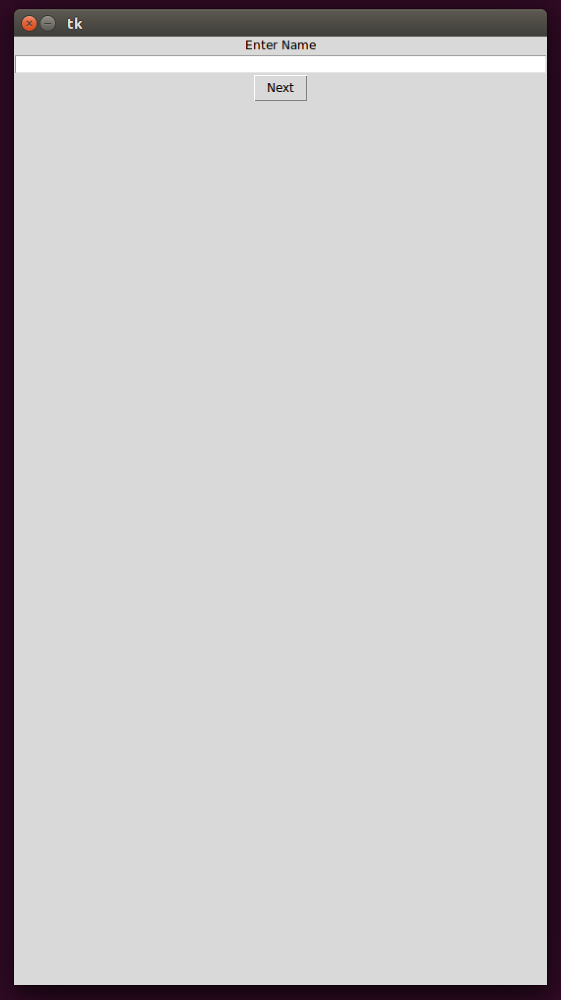
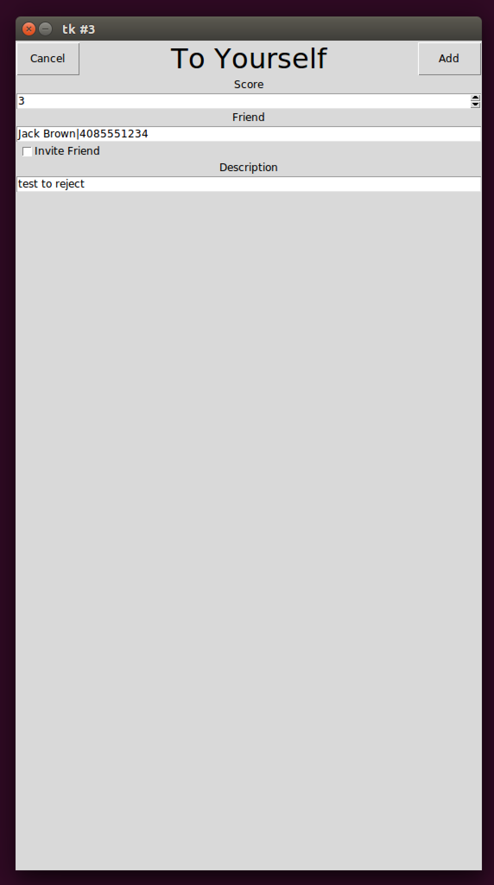

Table of Contents
=================

   * [Fase Elements](#fase-elements)
      * [Comparing Fase Elements to similar Elements in iOS/Android/Tkinter](#comparing-fase-elements-to-similar-elements-in-iosandroidtkinter)
      * [Data Classes](#data-classes)
      * [Elements Classes](#elements-classes)
   * [Drawing Elements](#drawing-elements)
      * [Mobile Device Differences](#mobile-device-differences)
      * [Abstract Elements on iOS](#abstract-elements-on-ios)
      * [Abstract Elements on Android](#abstract-elements-on-android)
      * [Screen](#screen)
      * [Layout Vertical](#layout-vertical)
      * [Layout Horizontal](#layout-horizontal)
   * [Fase Application Examples](#fase-application-examples)
      * [Hello World Application](#hello-world-application)
         * [Initial Screen](#initial-screen)
         * [Hello Screen](#hello-screen)
      * [Notes Application](#notes-application)
         * [Initial Screen](#initial-screen-1)
         * [Adding New Note](#adding-new-note)
         * [Home Screen with Notes](#home-screen-with-notes)
      * [KarmaCounter Application](#karmacounter-application)
         * [Sign In/Sign Up](#sign-insign-up)
         * [Sign Up](#sign-up)
         * [Dashboard](#dashboard)
         * [Your Events](#your-events)
         * [Adding Event to Yourself](#adding-event-to-yourself)
         * [Statistics by Cities](#statistics-by-cities)

# Fase Elements
## Comparing Fase Elements to similar Elements in iOS/Android/Tkinter
|Fase|iOS|Android|Tkinter|
|----|---|-------|-------|
|Frame|UIView|FrameLayout|Frame|
|Label|UILabel|TextView|Label|
|Text|UITextField|EditText|Entry|
|Switch|UISwitch|Switch|CheckButton|
|Select|UIPickerView|Spinners|ComboBox|
|Slider|UISlider|SeekBar|Scale|
|Image|UIImage|ImageView|Label|
|MenuItem|||Menu.add_command|
|Menu|||Menu|
|Button|UIButton|Button|Button|
|ButtonBar|||-|
|ContactPicker|||-|
|DateTimePicker|UIDatePicker|DatePicker|-|
|PlacePicker|Implemented using Google Place Picker|Implemented using Google Place Picker|-|
|Separator|-|-|Separator|
|Web|WKWebView|WebView|-|

## Data Classes
* **Locale**
  * *country_code*: string

* **Contact**
  * *display_name*: string
  * *phone_number*: string

* **Place**
  * *google_place_id*: string
  * *city*: string
  * *state*: string
  * *country*: string

* **User**
  * *user_id*: string
  * *phone_number*: string
  * *first_name*: string
  * *last_name*: string
  * *date_of_birth*: date
  * *home_city*: *Place*
  * *locale*: *Locale*
  * *datetime_added*: date

## Elements Classes
* **Element**. Basic Interface.

* **ElementContainer** extends *Element*. Basic Interface which contains list if id and Element pairs.
  * *id_element_list*: list(tuple(string, *Element* or subclass))

* **VisualElement** extends *ElementContainer*. Basic Interface for Visual Elements.
  * *id_element_list*: list(tuple(string, *Element* or subclass))
  * *displayed*: bool
  * *request_locale*: bool
  * *locale*: *Locale*

* **Label** extends *VisualElement*
  * *id_element_list*: list(tuple(string, *Element* or subclass))
  * *displayed*: bool
  * *request_locale*: bool
  * *locale*: *Locale*
  * *text*: string
  * *font*: float
  * *size*: int
  * *align*: int
  * *on_click*: function
    * FONT_LIST = [0.5, 0.75, 1., 1.25, 1.5]
    * MIN = 1
    * MAX = 2
    * LEFT = 1
    * RIGHT = 2
    * CENTER = 3

* **Text** extends *VisualElement*
  * *id_element_list*: list(tuple(string, *Element* or subclass))
  * *displayed*: bool
  * *request_locale*: bool
  * *locale*: *Locale*
  * *text*: string
  * *hint*: string
  * *size*: int
  * *type*: int
  * *multiline*: bool
    * MIN = 1
    * MAX = 2
    * TEXT = 1
    * DIGITS = 2
    * PHONE = 3
    * EMAIL = 4

* **Switch** extends *VisualElement*
  * *id_element_list*: list(tuple(string, *Element* or subclass))
  * *displayed*: bool
  * *request_locale*: bool
  * *locale*: *Locale*
  * *value*: bool
  * *text*: string
  * *align*: int
    * LEFT = 1
    * RIGHT = 2
    * CENTER = 3

* **Select** extends *VisualElement*
  * *id_element_list*: list(tuple(string, *Element* or subclass))
  * *displayed*: bool
  * *request_locale*: bool
  * *locale*: *Locale*
  * *value*: string
  * *items*: list(string)
  * *hint*: string
  * *align*: int
    * LEFT = 1
    * RIGHT = 2
    * CENTER = 3

* **Slider** extends *VisualElement*
  * *id_element_list*: list(tuple(string, *Element* or subclass))
  * *displayed*: bool
  * *request_locale*: bool
  * *locale*: *Locale*
  * *value*: float
  * *min_value*: float
  * *max_value*: float
  * *step*: float

* **Image** extends *VisualElement*
  * *id_element_list*: list(tuple(string, *Element* or subclass))
  * *displayed*: bool
  * *request_locale*: bool
  * *locale*: *Locale*
  * *filename*: string
  * *url*: string

* **MenuItem** extends *VisualElement*
  * *id_element_list*: list(tuple(string, *Element* or subclass))
  * *displayed*: bool
  * *request_locale*: bool
  * *locale*: *Locale*
  * *text*: string
  * *on_click*: function

* **Menu** extends *ElementContainer*
  * *id_element_list*: list(tuple(string, *Element* or subclass))
  * *text*: string

* **Button** extends *VisualElement*
  * *id_element_list*: list(tuple(string, *Element* or subclass))
  * *displayed*: bool
  * *request_locale*: bool
  * *locale*: *Locale*
  * *text*: string
  * *align*: int
  * *on_click*: function
    * LEFT = 1
    * RIGHT = 2
    * CENTER = 3

* **Navigation** extends *ElementContainer*
  * *id_element_list*: list(tuple(string, *Element* or subclass))

* **ContactPicker** extends *VisualElement*
  * *id_element_list*: list(tuple(string, *Element* or subclass))
  * *displayed*: bool
  * *request_locale*: bool
  * *locale*: *Locale*
  * *contact*: *Contact*
  * *hint*: string
  * *size*: int
  * *on_pick*: function
    * MIN = 1
    * MAX = 2

* **DateTimePicker** extends *VisualElement*
  * *id_element_list*: list(tuple(string, *Element* or subclass))
  * *displayed*: bool
  * *request_locale*: bool
  * *locale*: *Locale*
  * *datetime*: date
  * *type*: int
  * *hint*: string
  * *size*: int
    * DATE = 1
    * TIME = 2
    * DATETIME = 3
    * MIN = 1
    * MAX = 2

* **PlacePicker** extends *VisualElement*
  * *id_element_list*: list(tuple(string, *Element* or subclass))
  * *displayed*: bool
  * *request_locale*: bool
  * *locale*: *Locale*
  * *place*: *Place*
  * *type*: int
  * *hint*: string
  * *size*: int
    * CITY = 1
    * MIN = 1
    * MAX = 2

* **Separator** extends *VisualElement*
  * *id_element_list*: list(tuple(string, *Element* or subclass))
  * *displayed*: bool
  * *request_locale*: bool
  * *locale*: *Locale*

* **Web** extends *VisualElement*
  * *id_element_list*: list(tuple(string, *Element* or subclass))
  * *displayed*: bool
  * *request_locale*: bool
  * *locale*: *Locale*
  * *url*: string
  * *size*: int
  * *scrollable*: bool
    * MIN = 1
    * MAX = 2

* **BaseElementsContainer** extends *VisualElement*
  * *id_element_list*: list(tuple(string, *Element* or subclass))
  * *displayed*: bool
  * *request_locale*: bool
  * *locale*: *Locale*

* **Frame** extends *BaseElementsContainer*
  * *id_element_list*: list(tuple(string, *Element* or subclass))
  * *displayed*: bool
  * *request_locale*: bool
  * *locale*: *Locale*
  * *orientation*: int
  * *size*: int
  * *on_click*: function
  * *border*: bool
    * VERTICAL = 1
    * HORIZONTAL = 2
    * MIN = 1
    * MAX = 2

* **Alert** extends *ElementContainer*
  * *id_element_list*: list(tuple(string, *Element* or subclass))
  * *text*: string

* **Screen** extends *BaseElementsContainer*
  * *id_element_list*: list(tuple(string, *Element* or subclass))
  * *displayed*: bool
  * *request_locale*: bool
  * *locale*: *Locale*
  * *_screen_id*: string
  * *scrollable*: bool
  * *title*: string
  * *on_refresh*: function
  * *on_more*: function

*Screen* can have one or following Elements:

|id|Element|Description|
|--|-------|-----------|
|'next_step_button'|Button|Button responsible for Next step ("Save", "Done", "Send")|
|'prev_step_button'|Button|Button responsible for Previous step ("Cancel", "Back")|
|'context_menu'|Menu|Screen context menu which is usually accessible via button in right upper corner|
|'alert'|Alert|Information needed to show Alert|
|'main_menu'|Menu|Main Menu, usually big menu accessible via button on left upper corner| 
'main_button'|Button|Main Button responsible for main action ("New"), usually bigger than other navigation buttons. On iOS usually in the middle of bottom navigation bar, on Android usually separate Button on right lower corner|
|'button_bar'|Button Bar|Collection of navigation buttons. On iOS usually are bottom buttons, on Android usually located in Main Menu|

# Drawing Elements

## Mobile Device Differences
|Element|iOS|Android|Windows Phone|
|-------|---|-------|-------------|
|Main button|Button in the right upper corner|Big button in the right bottom corner|Button in the middle of the button bar|
|Navigation|Buttons on bottom bar|Items in main menu from left top button|Buttons on top and bottom bar|
|Next button|Button in the right upper corner|Button in the right upper corner||
|Prev button|Button in the left upper corner|Built in system back button||

## Abstract Elements on iOS

## Abstract Elements on Android

## Screen

## Layout Vertical

## Layout Horizontal

# Fase Application Examples

## Hello World Application

### Initial Screen
Initial Screen has only Text field for entering name and "Next" button.

### Hello Screen
After clicking on "Next" button, Hello Screen has greeting and "Reset" button. "Reset" button returns application to
Initial Screen.

## Notes Application

### Initial Screen
Initial Screen has bottom Navigation Buttons and Main Button for adding New Note, but has no Notes.

### Adding New Note
After clicking on Main Button, Adding New Note has one-liner Text field for header and multiline Text field for note
content.
* Text field should be multiline!
* Labels on top of Text fields should be grey hints inside Text fields!

### Home Screen with Notes
After adding two Notes, Home Screen has two Notes and same navigation buttons.

## KarmaCounter Application
Native-version of KarmaCounter can be downloaded from
[AppStore](https://itunes.apple.com/us/app/karmacounter/id1242742105?mt=8) and
[Google Play](https://play.google.com/store/apps/details?id=com.karmacounter&hl=en).
Below is slightly modified version of KarmaCounter which has bottom button bar with navigation buttons.

### Sign In/Sign Up
* Buttons should have width equal to Screen width!
* Labels on top of Text fields should be grey hints inside Text fields!

### Sign Up

### Dashboard

**Screenshot (Main Menu)**
* Main Menu should be sliding Main Menu!
")

**Screenshot (Main Button Context Menu)**
")

### Your Events

**Screenshot (Context Menu Button)**
* Context Menu Button should be implement using built-in tool like iOS's ActionSheet!
")

### Adding Event to Yourself

### Statistics by Cities

