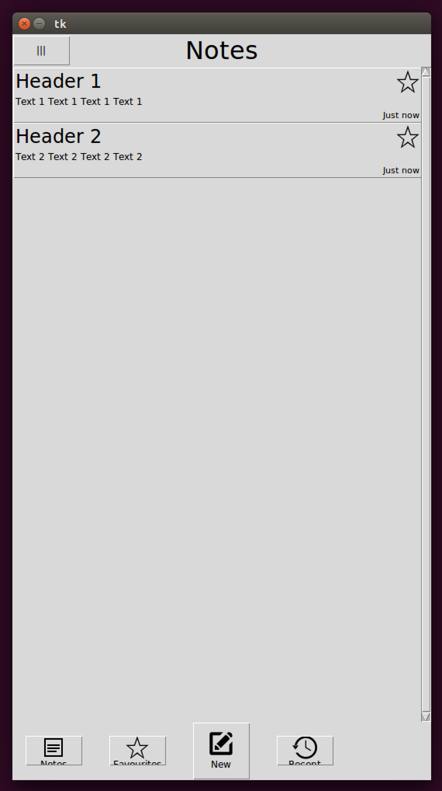
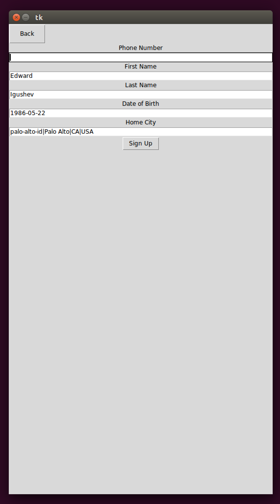
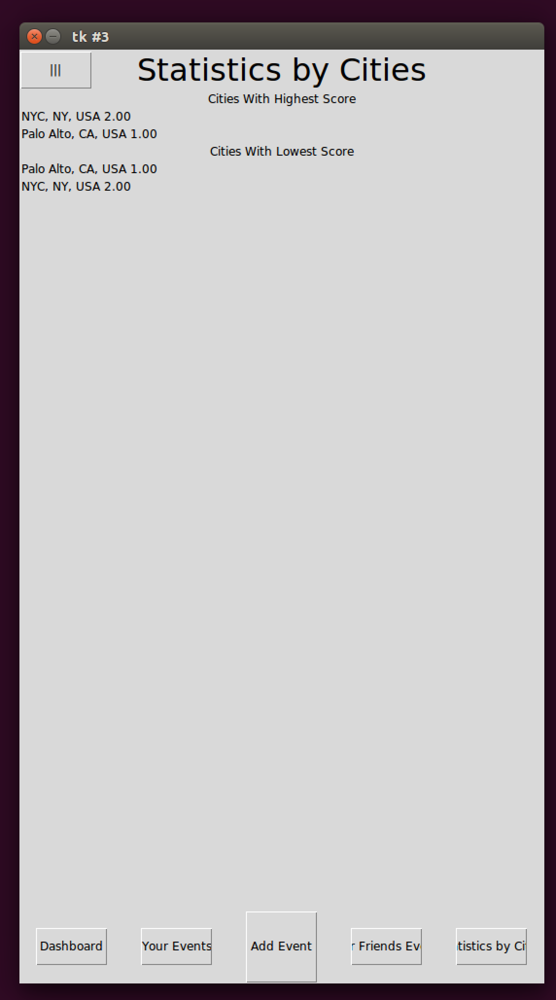

Table of Contents
=================

   * [Fase Application Examples](#fase-application-examples)
      * [Hello World Application](#hello-world-application)
         * [Initial Screen](#initial-screen)
         * [Hello Screen](#hello-screen)
      * [Notes Application](#notes-application)
         * [Initial Screen](#initial-screen-1)
         * [Adding New Note](#adding-new-note)
         * [Home Screen with Notes](#home-screen-with-notes)
      * [KarmaCounter Application](#karmacounter-application)
         * [Sign In/Sign Up](#sign-insign-up)
         * [Sign Up](#sign-up)
         * [Dashboard](#dashboard)
         * [Your Events](#your-events)
         * [Adding Event to Yourself](#adding-event-to-yourself)
         * [Statistics by Cities](#statistics-by-cities)

# Fase Application Examples

## Hello World Application

### Initial Screen
Initial Screen has only Text field for entering name and "Next" button.

### Hello Screen
After clicking on "Next" button, Hello Screen has greeting and "Reset" button. "Reset" button returns application to
Initial Screen.

## Notes Application

### Initial Screen
Initial Screen has bottom Navigation Buttons and Main Button for adding New Note, but has no Notes.

### Adding New Note
After clicking on Main Button, Adding New Note has one-liner Text field for header and multiline Text field for note
content.
* Text field should be multiline!
* Labels on top of Text fields should be grey hints inside Text fields!

### Home Screen with Notes
After adding two Notes, Home Screen has two Notes and same navigation buttons.

## KarmaCounter Application
Native-version of KarmaCounter can be downloaded from
[AppStore](https://itunes.apple.com/us/app/karmacounter/id1242742105?mt=8) and
[Google Play](https://play.google.com/store/apps/details?id=com.karmacounter&hl=en).
Below is slightly modified version of KarmaCounter which has bottom button bar with navigation buttons.

### Sign In/Sign Up
* Buttons should have width equal to Screen width!
* Labels on top of Text fields should be grey hints inside Text fields!

### Sign Up

### Dashboard

**Screenshot (Main Menu)**
* Main Menu should be sliding Main Menu!
")

**Screenshot (Main Button Context Menu)**
")

### Your Events

**Screenshot (Context Menu Button)**
* Context Menu Button should be implement using built-in tool like iOS's ActionSheet!
")

### Adding Event to Yourself

### Statistics by Cities

